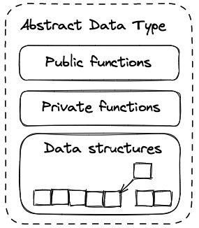
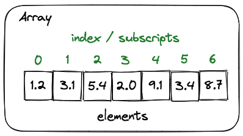
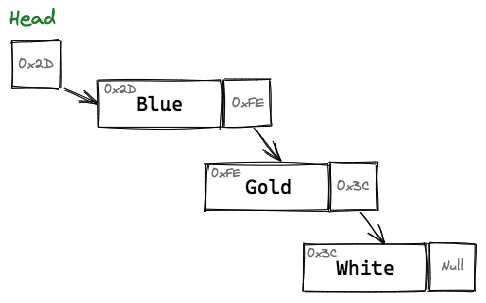
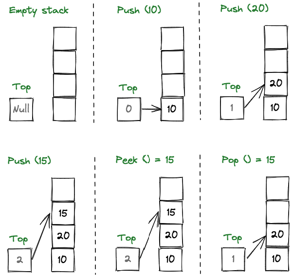
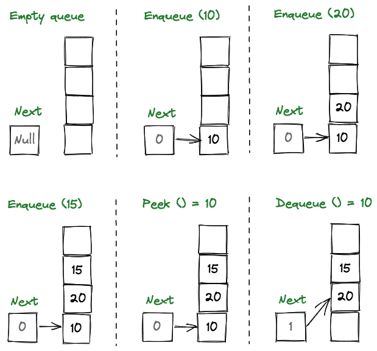
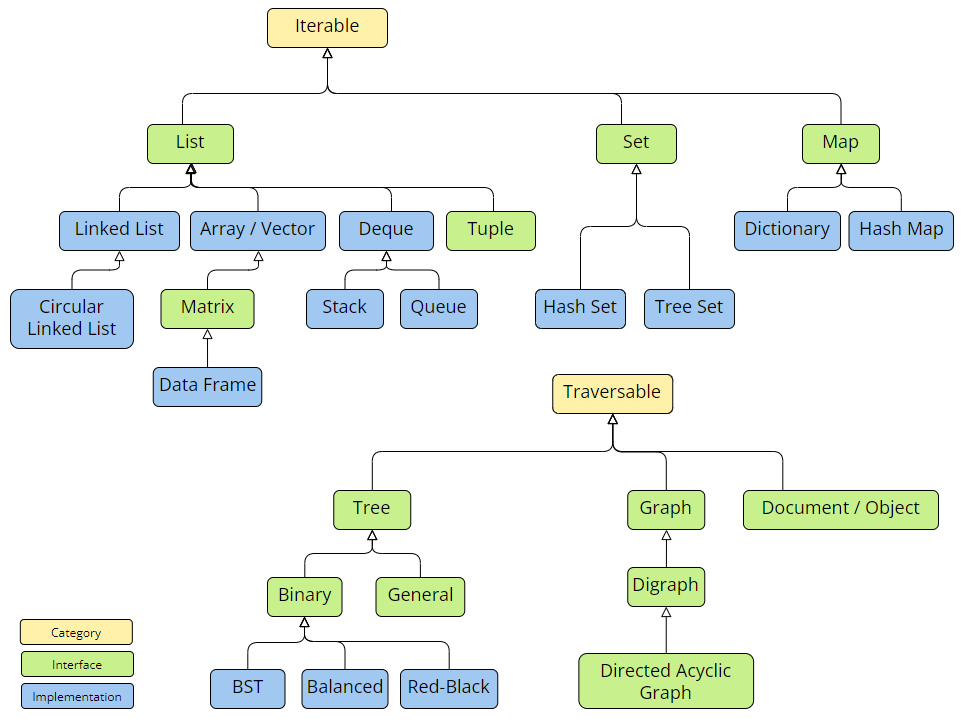

# Data Structures and Algorithms

A data structure is a specialized format for organizing, processing, retrieving and storing data.

Each data structure contains:
- Information about the data values
- Relationships between the data
- Functions (operations) that can be applied to the data

### Characteristics of data structures

- Linear or non-linear
    - Whether the data items are arranged in chronological sequence (array) or in an unordered sequence (graph)
- Homogeneous or non-homogeneous
    - Whether all data items in a given repository are of the same type (array) or of various types (tuple)
- Static or dynamic
    - How the data structures are compiled
    - Static data structures have fixed sizes, structures and memory locations at compiletime
    - Dynamic data structures have sizes, structures and memory locations that can shrink or expand depending on the use
- Primitive (in-built) or non-primitive (abstract) data structures
    - The primitive data structures (in-built data types) have different representation on different computers, and are directly operated upon by the machine instructions
        - Integer, float, double, character, pointer
    - Non-primitive data structures are developed from the primitive data structure, and is responsible for organizing the group of homogeneous and heterogeneous data elements
        - Arrays, lists, files

### Types of abstract data structures

We create data structures along with their operations to simplify the process of solving problems. 

Such data structures that are not in-built are known as Abstract Data Type (ADT).

Features of ADT:
- The user does not need to know the implementation of the data structure only essentials are provided (Abstraction)
- ADT gives us a better conceptualization of the real world
- The program becomes more robust with the ability to detect errors

#### Arrays

- An Array stores a collection of Elements (Items, Nodes) at adjoining memory locations
- The position of each Element can be calculated or retrieved easily
- Can be fixed or flexible in length
- Can be one dimensional or multi dimensional

#### Linked Lists

- A Linked List stores a collection of Elements (Items, Nodes) in a linear order
- Each Element in a Linked List contains a Data Item as well as a Reference (Link) to the next item in the list

#### Stacks

- Stack is a linear data structure that follows a particular order in which the operations are performed
    - LIFO (Last In First Out) = FILO (First In Last Out)
- Supports `push`, `pop` and `peek` operations
- A Stack can be used for:
    - Evaluating expressions consisting of operands and operators (arithmetic expressions)
    - Check parenthesis matching in an expression (backtracking)
    - Reverse a data
- Can be implemented using Arrays or Linked Lists

#### Queues

– Stores a collection of Elements (Items, Nodes), similar to a stack; however the operation order can only be FIFO (First In First Out)
- Supports `enqueue`, `dequeue` and `peek` operations

#### Trees

> @TODO Drawing
> @TODO Tree types

- A Tree stores a collection of Elements (Items, Nodes) in an abstract hierarchical way
- Each Element is linked to other Elements and can have multiple sub-values also known as Children
– The top Element in a hierarchy of a tree is referred as the Root of the tree
- The remaining data elements are partitioned into a number of mutually exclusive Subsets and they itself a Tree and are known as the Subtree.

#### Maps

